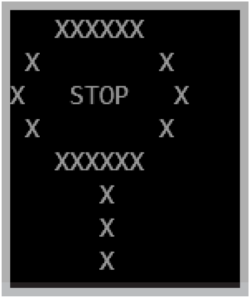

Write a program named _StopSign_ that displays a pattern similar to the image shown below.

The number of spaces for each row in the image shown above are as follows: 
1. 3 spaces (all padding left)
2. 9 spaces (1 padding left)
3. 6 spaces
4. 9 spaces (1 padding left)
5. 3 spaces (all padding left)
6. 6 spaces (all padding left)
7. 6 spaces (all padding left)
8. 6 spaces (all padding left)

