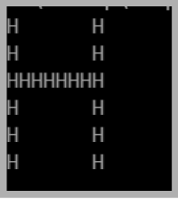

Write a program named _BigLetter_ that displays a large letter composed of smaller
letters. For example, if you choose **H**, then the output should look similar to the image shown below 

### Grading
This lab does not contain automated grading.
