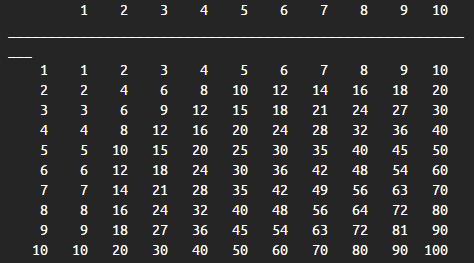

Write an application named *DisplayMultiplicationTable* that displays a table of the products of every combination of two integers from 1 through 10. Your output should resemble the figure below. 

