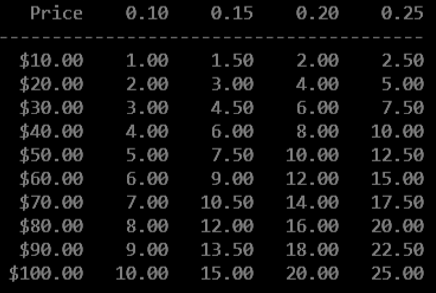

In a “You Do It” section of _Chapter 5_ in your book, you created a tipping table for patrons to use when analyzing their restaurant bills. Now, create a modified program named *TippingTable3* in which each of the following values is obtained from user input:

* The lowest tipping percentage
* The highest tipping percentage
* The lowest possible restaurant bill
* The highest restaurant bill

Below is a summary of the "You Do It" section's instructions:

*Write a program that creates a tipping table that restaurant patrons can use to approximate the correct tip for meals. Prices range from $10 to $100, and tipping percentage rates range from 10 percent to 25 percent. The program uses several loops. An example of the program is shown below:*

> In order to prepend the *$* to currency values, the program will need to use the `CultureInfo.GetCultureInfo` method. In order to do this, include the statement `using System.Globalization;` at the top of your program and format the output statements as follows: `WriteLine("This is an example:  {0}", value.ToString("C", CultureInfo.GetCultureInfo("en-US")));`

