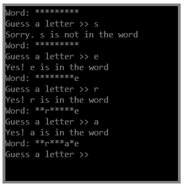

>This problem relies on the generation of a random number. You can create a random number that is at least min but less than max using the following statements:
```cs
Random ranNumberGenerator = new Random();
int randomNumber;
randomNumber = ranNumberGenerator.Next(min, max);
```

Create a game similar to Hangman named *GuessAWord* in which a player guesses letters to try to replicate a hidden word. Store at least eight words in an array, and randomly select one to be the hidden word.

Initially, display the hidden word using asterisks to represent each letter. Allow the user to guess letters to replace the asterisks in the hidden word until the user completes the entire word. 

If the user guesses a letter that is not in the hidden word, display an appropriate message. 

If the user guesses a letter that appears multiple times in the hidden word, make sure that each correct letter is placed. 

Figure 6-27 shows a typical game in progress.



**Figure 6-27 ** Typical execution of console-based GuessAWord program

### Grading
This lab does not contain automated grading.