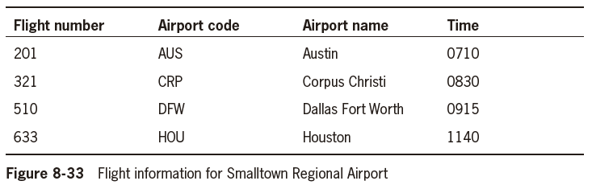

Create a program for Smalltown Regional Airport Flights that accepts either an integer flight number or string airport code from the options in Figure 8-33.

Pass the user’s entry to one of two overloaded `GetFlightInfo()` methods, and then display a returned string with all the flight details. For example, if **201** was input, the output would be: **Flight #201 AUS Austin Scheduled at: 0710** (note that there should be two spaces between 'Austin' and 'Scheduled').

The method version that accepts an integer looks up the airport code, name, and time of flight; the version that accepts a string description looks up the flight number, airport name, and time.

The methods return a message if the flight is not found. For example, if **100** was input, the output should be **Flight #100 was not found**.

If no flights were scheduled for the airport code entered, for example **MCO**, the message displayed should be **Flight to MCO was not found**.

<p align='center'>
    
</p>
<sup>Figure 8-33</sup>

Examples of the program are shown below:

```
Please enter flight number or airport code >> MIA
Flight to MIA was not found
```

```
Please enter flight number or airport code >> AUS
Flight #201 AUS Austin Scheduled at: 0710
```

```
Please enter flight number or airport code >> 510
Flight #510 DFW Dallas Fort Worth Scheduled at: 0915
```
