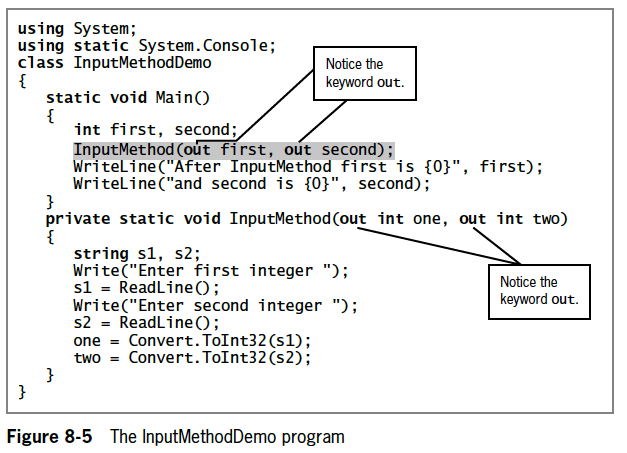

Write a program named *InputMethodDemo2* that eliminates the repetitive code
in the `InputMethod()` in the InputMethodDemo program in Figure 8-5.

Rewrite the program so the `InputMethod()` contains only two statements:
```cs
one = DataEntry("first");
two = DataEntry("second");
```
(Note: The program in Figure 8-5 is provided as starter code.)

**Figure 8-5:**


